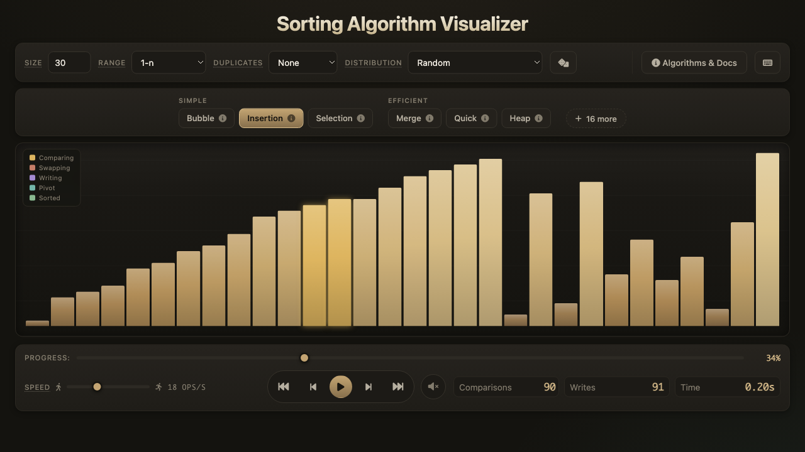
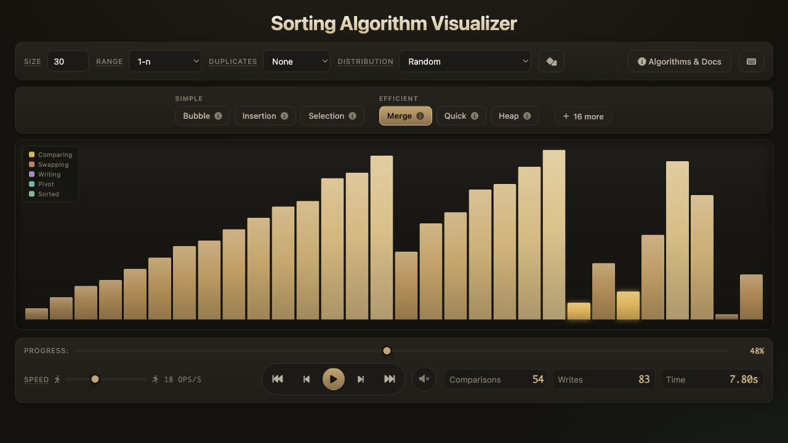
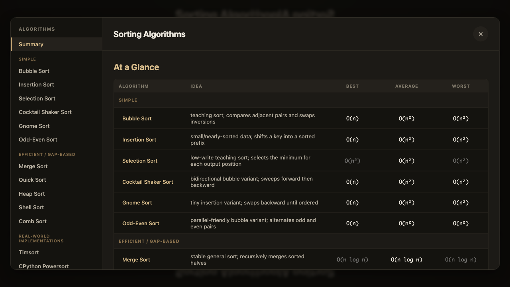

# Sorting Algorithm Visualizer

An interactive sorting algorithm visualizer for exploring how different sorting strategies behave in motion. Pick an algorithm, shape the input array, then play through the recorded operation stream with pause, stepping, rewind, fast jumps, scrubbing, speed control, visual highlights, stats, docs, and optional sound.



## What You Can Do

- Watch 22 sorting algorithms operate step by step, from classic teaching sorts to real-world hybrids.
- Change array size, value range, duplicate density, and input distribution to see how the same algorithm responds to different data.
- Pause any run, step forward or backward, jump 50 operations at a time, or scrub through the full recorded sort.
- Read comparisons, writes, shuffles, elapsed time, pivot markers, sorted regions, and active operation colors while the sort runs.
- Open built-in algorithm docs with complexity notes, case presets, explanations, and Python reference implementations; when an algorithm is selected, the docs button opens directly to that entry.
- Turn on sound when using smaller arrays; pitch follows the values being touched.

## In Action



The docs modal keeps the learning material close to the visualization. It gives a quick comparison table, then deeper per-algorithm explanations when you want to connect what you just saw to time complexity, space usage, and reference code.



## Run Locally

This app uses browser modules, so serve the folder instead of opening `index.html` directly.

```sh
python -m http.server
```

Then open:

```text
http://127.0.0.1:8000
```

You can also use a static server such as:

```sh
npx serve .
```

The app itself has no build step and no package install requirement. Font Awesome icons are loaded from a CDN, so an internet connection gives the interface its intended icon set.

## Algorithms Included

The visualizer includes a broad mix of sorting styles so the differences are easy to see, not just read about.

- Bubble Sort, Cocktail Shaker Sort, Gnome Sort, and Odd-Even Sort are simple adjacent-swap algorithms. They are useful for learning because their behavior is obvious on screen: local comparisons, lots of movement, and a visibly growing sorted region.
- Insertion Sort is especially interesting on nearly sorted data. In the visualizer, it often feels calm and efficient because each value usually travels only a short distance.
- Selection Sort scans heavily but writes sparingly. Its animation shows a clear pattern: look for the minimum, place it, repeat.
- Merge Sort is steady and predictable. It spends time writing merged runs back into the array, which makes it feel organized rather than chaotic.
- Quick Sort, Dual-Pivot Quick Sort, Introsort, and PDQSort show the drama of partitioning. Pivot highlights make it easy to see why good partition choices matter.
- Heap Sort has a distinctive rhythm: build a heap, repeatedly move the maximum into place, and repair the heap.
- Shell Sort and Comb Sort use gaps to move values long distances early, then settle into smaller local repairs.
- Counting Sort, Radix Sort, and Bucket Sort are value-sensitive rather than pure comparison sorts. Their behavior changes noticeably when you widen the value range or add duplicates.
- Timsort and CPython Powersort are adaptive, real-world-inspired merge sorts. They are most interesting with partially sorted runs, where they can take advantage of existing order.
- Bitonic Sort (useful for paralleizing) and Cycle Sort (useful for minimizing writes when writing degrades memory) round out the set with more specialized behavior, while Bogo Sort is included mostly as a cautionary joke with a recording cap.

## Controls

The most useful controls are visible in the main interface, and the keyboard shortcuts are there when you want to move faster:

- `Space`: play or pause.
- `Left` / `Right`: step backward or forward one operation.
- `Shift + Left` / `Shift + Right`: jump backward or forward 50 operations.
- `R`: generate a new array with the current settings.
- `M`: toggle sound.
- `D`: open the algorithm documentation.
- `?`: open the keyboard shortcuts panel.
- `Esc`: close dialogs.

## Input Shapes

The distribution menu is where the app becomes more than a random-array demo. Try sorted, reversed, nearly sorted, sorted with a shuffled tail, rotated sorted, partially sorted runs, mountain, valley, sawtooth, zigzag, balanced-pivot, dual-pivot, and gap-stress inputs. These shapes make algorithm strengths and weaknesses much easier to feel.

For example, Insertion Sort looks dramatically better on nearly sorted input, Quick Sort can suffer when pivot choices are poor, and Timsort-style algorithms become more compelling when the array already contains meaningful runs.

## Project Structure

```text
index.html          Main document and control markup
style.css           Visual design, layout, responsive behavior
src/main.js         App wiring, state, events, playback driver
src/algorithms.js   Sorting generators and algorithm docs registry
src/arrays.js       Array generation, distributions, best/worst presets
src/engine.js       Operation recording and reversible playback cursor
src/renderer.js     Bar rendering and stats updates
src/audio.js        Optional Web Audio feedback
src/ui.js           Algorithm toolbar, docs modal, syntax highlighting
```

## Notes

The app records a full operation stream before playback starts. That design is what makes rewind, reverse stepping, fast jumps, and scrub-to-anywhere playback feel consistent across every algorithm.

For very large arrays, smooth animation and sound are intentionally reduced or disabled so the visualizer remains responsive. For the richest visual experience, start with 30 to 100 elements and then scale up once you know what you want to compare.
